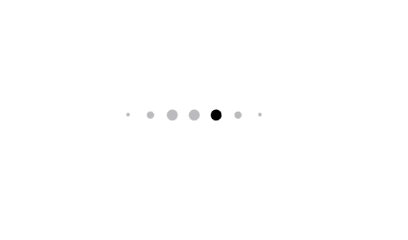

# BriefPagingControl

BriefPageControl is similar to Instagram's PageControl, and SwiftUI is used.

You can use touch and drag of UIPageControl. You can also set the size, color and animation.





## Installation

Supports iOS14 or later.

### Swift Package Manager

1. In Xcode, select “File” → “Add Package Dependencies...”
1. Enter https://github.com/tkarlz/BriefPagingControl.git

or you can add the following dependency to your `Package.swift`:
```swift
.package(url: "https://github.com/tkarlz/BriefPagingControl.git", .upToNextMajor(from: "1.0.1")),
```

## Usage

### Simply

```swift
BriefPagingControl(numberOfPages: pages.count, currentPage: $currentPage)
```

### You Want

```swift
BriefPagingControl(numberOfPages: pages.count, currentPage: $currentPage) { config in
    config.indicatorSize = 10
    config.spacing = 10
    config.currentIndicatorColor = .red
    config.indicatorColor = .orange
    config.numberOfMainIndicators = .five
    config.hidesForSinglePage = true
    config.animation = .snappy
}
```

### Default Confing

```swift
indicatorSize = 8
spacing = 8
currentIndicatorColor = .primary
indicatorColor = .gray.opacity(0.6)
numberOfMainIndicators = .three
hidesForSinglePage = false
animation = .default
```
